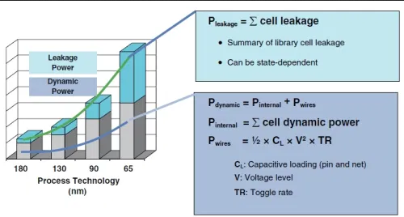
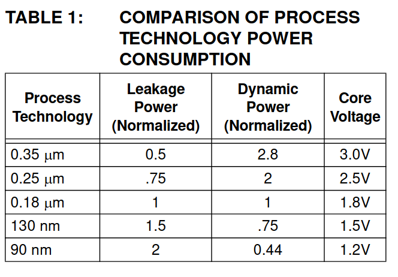
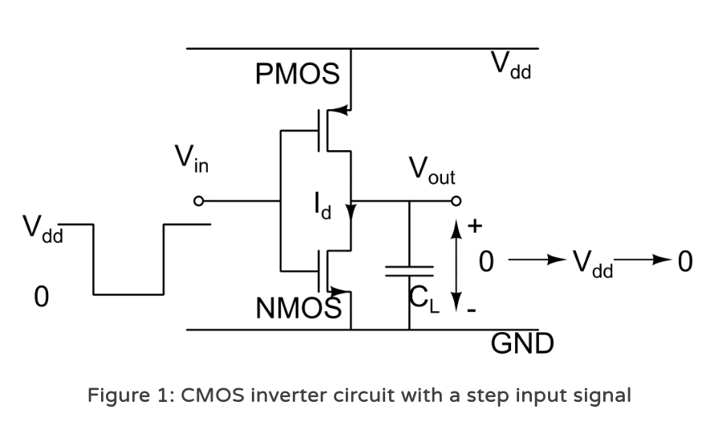
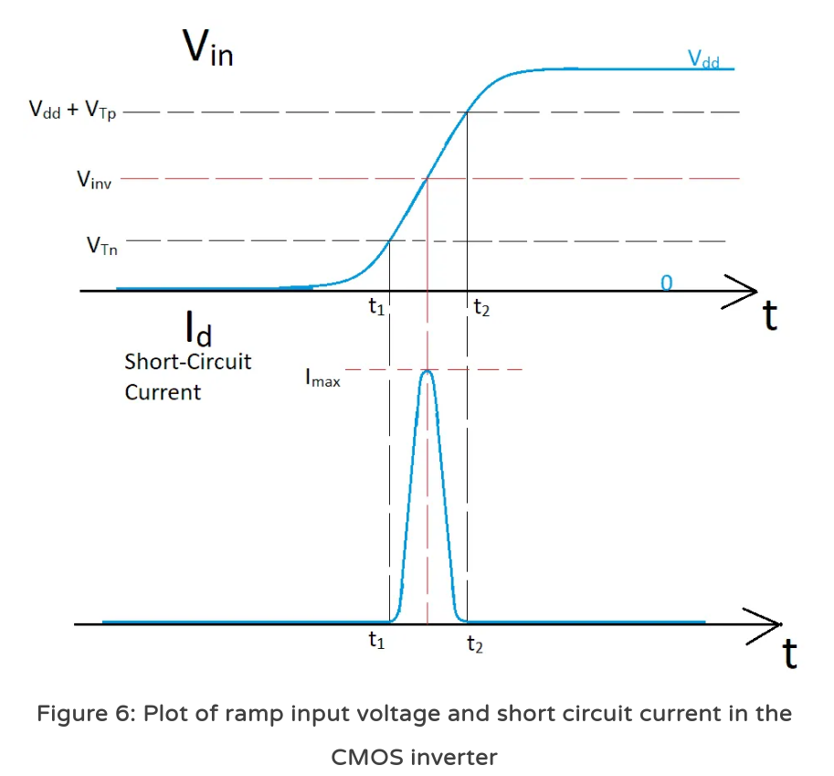

# Theory Week 10 - Interrupts

Are you ready for this week?


During this week we will focus on what interrupts are and why are they useful in Embedded Systems:
* Introduction to Power Consumption.
* Introduction to Interrrupts.
* Using Interrupts for direct task processing.
* Using Interrupts for flow management.

# Introduction to Power Consumption.
In essence whilst our CPU is running it will consume current.

Let's take a look at the main sources of power consumption of a digital CMOS based ASIC:
* Dynamic Power
* Static Power (Transistor Leakage)


Image taken from semiengineering.com (Cadence) (see the references)


Image taken from Microchip AN-1416(see the references)

## Dyanmic Power


Images taken from Technobyte.org (see the references)

## What can Software do about this?
So, how do we decrease the components of the following equation from software?

$$P = aCV^{2}f$$

* Operate at a slower frequency.
* Avoid transistors from toggling.
  * Put internal/external peripherals to sleep.
    * Not feeding clock.
    * Sleep Mode.
  * Put the whole CPU to sleep.
    * How does sleep mode work?

## Putting Processors to sleep

This is highly dependant on your architecture.

For details about PIC's checkout Microchip's Low-Power Design Guide AN-1416.

In essence:

```C
//Replace: 
while(!ADCInterruptFlag); 

//With: 
while(!ADCInterruptFlag)
{
  Idle(); //wake on ADC interrupt
}
```

This is another example from the XC8 Compiler User's Guide
```C
#include <xc.h>
extern void init(void);
void main (void)
{
  init(); /* enable peripherals/interrupts */
  while(1)
    SLEEP(); /* save power while nothing happening */
}
```

# Introduction to Interrupts
## Why do we need this?
Two main motivations to speak about interrupts in Embedded Systems:
* Power Consumption.
* Response latency requirements.


## How Interrupts work
There will be situations where your boss will want you to stop everything that you are doing, and change your current processed task to something else, for example:
* There may be a critical failure at a customer site.
* They may want to introduce you to a new team member.
* There may be a delivery at the door and some boxes need moving.
* They may just want to grab you for a chat.

The same happens with a CPU. In the context of Embedded Systems:
* The value of an input may have changed that triggers an action.
* Certain time has passed and we must undertake an action, or check for something.
* One or our hardware peripherals has finished its task and needs servicing.

## What are Interrupts?
Interrupts is a mechanism embedded in the CPU that that changes the next value of the PC, thus allowing the CPU to execute a different arbitrary instruction other than the one that was supposed to come next.

## What happens at the CPU level?
In very general terms the same when a function is called:
* Context is saved
* Interrupt Service Routine (IRS) is called (depends on architecture)
  * Hopefully the first thing the IRS will do is to turn off other interrupts
  * Execute code
* Come back to previous execution context.

# Using Interrupts for direct task processing.
In Chapter 4 Elecia presents one simple application for the direct use of Interrupts: Getting the processor interrupted when a pin goes high or low.

One can use interrupts to drive code. For example:
* Execute a routine when a pin goes high.
  * Compute the next state of a FSM.
  * Turn on/off an LED.
* Execute a routine when a peripheral needs servicing.

**Question:** Why is this not great?


# Using Interrupts for flow management.
Another way of using interrupts is in order to change the normal flow of a program.

In this scheme code is not executed directly during an ISR, but rather some form of messaging is passed to the normal loop in order to signal that an event has happened.

## Event Driven Programming

Event Driven Programming is a paradigm where the flow of a program is controlled by means of events. When an event happens some form of message is created. When the control loop is executed then the message is processed.


# References
- Elecia White, Making Embedded Systems: Design Patterns for Great Software. Chapters 4,5,10.
- [Wikipedia - Event Driven Programming](https://en.wikipedia.org/wiki/Event-driven_programming)
- [Wikipedia - CMOS](https://en.wikipedia.org/wiki/CMOS)
- [Texas Instruments, CMOS Power Consumption and Cpd Calculation](https://www.ti.com/lit/an/scaa035b/scaa035b.pdf?ts=1616608023209)
- [Rajeevan Amirtharajah, CMOS Power Dissipation and Trends](https://www.ece.ucdavis.edu/~ramirtha/EEC216/W08/lecture1_updated.pdf)
- [Archishman Biswas, CMOS Inverter – Power and Energy Consumption](https://technobyte.org/cmos-inverter-power-energy-consumption/)
- [Semiengineering.com - Power Consumption](https://semiengineering.com/knowledge_centers/low-power/low-power-design/power-consumption/)
- [Microchip - AN1416 Low-Power Design Guide](http://ww1.microchip.com/downloads/en/AppNotes/01416a.pdf)
