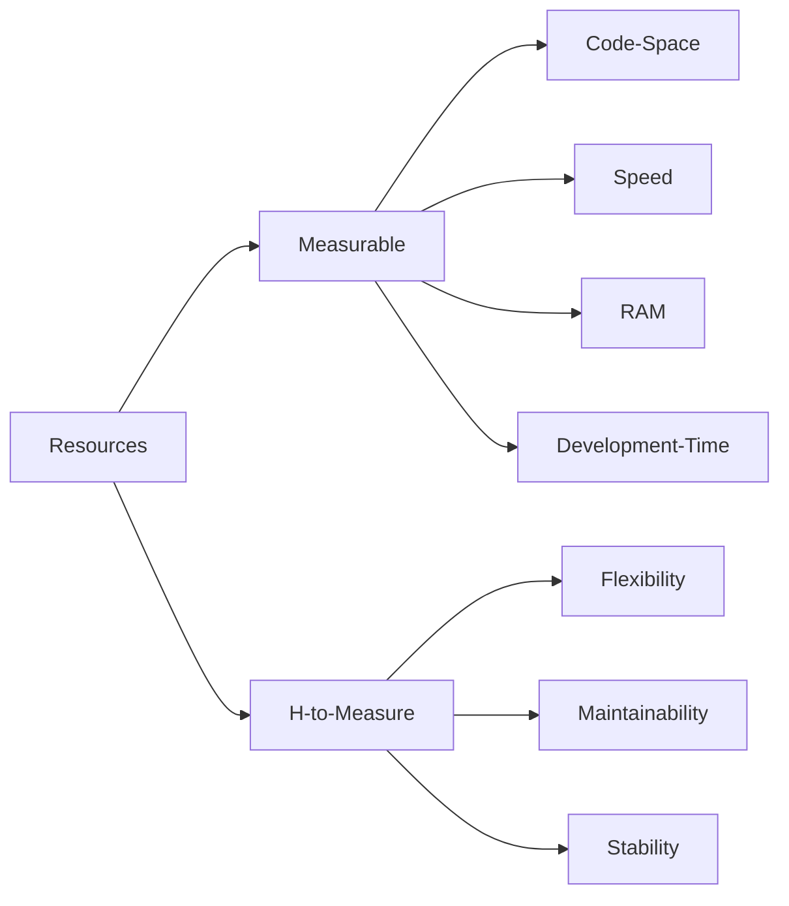

# Week 11 - Optimizations / Software Engineering.
* Optimizations
  * Resource optimization model
  * Optimization examples
  * A critical view of optimizations

# Optimizations
Of course we want to make an optimal design.

What makes a design optimal?

## Resource Optimization Model
I would like now to give a general description of what optimization entails.

### Steps
* Lay of the land: how much you have of what.
* Do experiments: record the impact of different techniques.
* Assess: Is this enough? Do I still have resources for the next round?
  * Keep a table with optimization results:
     * It will help you evaluate the trade-offs
     * It will help you show the trade-offs to your colleagues

### What you do has an impact.
* Every action (and in-action), in the project will consume one of your resources.
* Every action (and in-action), will have an impact in the project.

* Worth mentioning that all optimizations bear trade-offs, from Elecia:
> There are trade-offs in optimization. You can share resources between subsystems, but every time you do that, your product becomes a little less robust and a little more fragile for the next person to modify. There is something incredibly embarrassing about handing a project off to another team and explaining that they should never change subsystem X, because it will change the very precise timing of subsystem Y.

### Economical view of Optimizations
In order to help explain the process to a person with a business background, Elecia presents optimizations as an economics problem.

This idea can be used to highlight to us engineers the full spectrum of our resources:
> You start out with a portfolio of assets associated with your system. The major ones are the RAM, processor cycles, and code space. You may also have some auxiliary assets in power consumption and peripheral support on your processor. Your most liquid asset is development time, so think of that as money. Once you invest (or allocate) these assets to parts of the system, you lose the opportunity to use them in other subsystems.

These then are our resources

Following on with Elecia's idea:
> If the set of investments you initially selected does not deliver the expected returns, you might partially recoup the spent resources, but to do so you will need to sink more development time into the project. As you go further along the development path, switching the allocations becomes more and more costly (and less and less possible). Making the right call at the start of the design process can mean the difference between buying at the bottom of the market and losing your shirt.

Let me let that sink: When optimizing you are using more than processor's resources. How much *worth* an optimization was needs to be assessed against its total cost, including those untangibles.

Why is it important to consider this, specially if you are a technical leader?

I would like you to remember: is probably fair to say we are optimizing all the time; discussions arise when we have a conflicting value system for our optimizations.

## Optimization Examples
Let's go over a couple of examples of processor resource optimization.

### Optimizing Code Space
Code space is that being used by the compiled program.

* Idenfity what is taking space:
  * Read the Map File.
  * Take a look at the Linker script.
* Optimize:
  * Review library use: replace functions with custom implementations
    * Pay attention to the libraries included by each module
    * Pay attention to Read Only data:
      * Long string messages will take up space.
      * All constants take up space.
  * Balance function calls vs macros
  * Take a look at optimization flags for your compiler.
* Keep track of your optimizations.

>Tip from Elecia:
>
>If the map file doesn’t present the data in a way that is useful to you, write a script to parse it yourself!
>
>Read the map file, and create an output table where the height of the cell is proportional to the size of the function. This is pretty easy to do in Python, especially if you use HTML as the output.

### Optimizing RAM or Data space
Data space is that required for variables or function's stacks.

* Check what's taking space:
  * Take a look at the assembly to understand what is being used: registers or RAM.
  * Check the map file.
  * Review function parameters.
* Optimize:
  * Remove Malloc (don't use dynamic memory).
  * Balance the use of Registers and Local Variables
    * Minimize Scope.
    * Use the concept of function chains.
  * Evaluate Pros/Cons of Globals.
  * Memory Overlays.
* Keep track of your optimizations.

### Optimizing Processing Time (Speed)
This can be linked to the ammount of instructions the processor uses for an operation.

* Evaluate what is taking time: Profiling.
  * GPIO's and oscilloscope.
  * Using Timer.
  * Sampling.
* Optimize:
  * Memory Timing.
  * Variable Size (match native).
  * Consider the instructions (functions will take).
  * Reduce Math in Loops.
  * Loop Un-rolling (focus on the loops).
* Keep track of your optimizations.

### Optimizing Development Time
Any ideas on how can we optimize development time?

### Optimizing Money
Any ideas on how can we optimize money?

## A critical view of optimizations
You want to make sure that your optimization criteria matches the needs of the project.

From Elecia:
> ... you’ll get diminishing returns. The first 10% of improvement shouldn’t be too difficult, but the next 10% will probably take twice as long (and so on). Start with a goal, and don’t optimize much beyond there.

Plan for optimizations:
> One last point: many times, the tuning of the system is left to the end of the development cycle, even after the first testing has completed. I’ve heard that this is done on the theory that the features should work before they get tuned. The process of keeping the system within its resources should be planned for and maintained during system development. Introducing complex changes right before you ship a product will lead to an unstable system. Balance the risk of making a premature optimization (e.g., reading all of your assembly list code looking for ways the compiler could have reduced a single instruction) against the benefit of making an optimization early so it can be tested thoroughly and have an impact on other design considerations.

---

# References
* Elecia White, Making Embedded Systems - Design Patterns for Great Software. Chapter 8.

