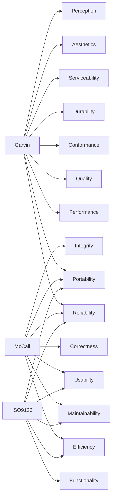
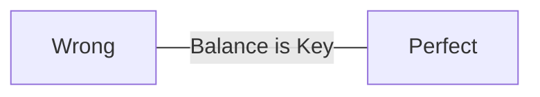
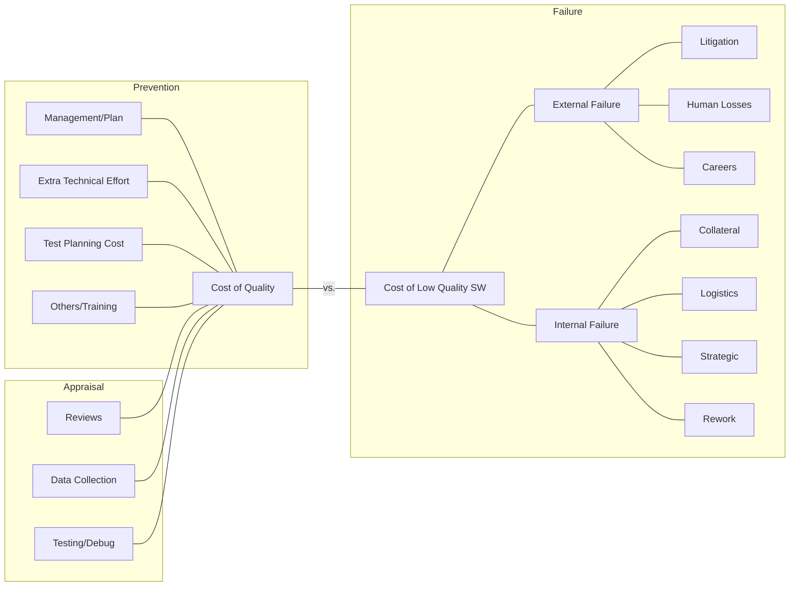
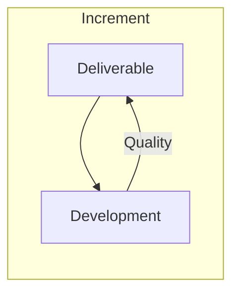
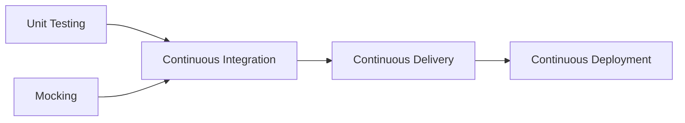

# Week 7 - Pictures

```mermaid
graph LR;
    Garvin  --> Performance;
    Garvin  --> Quality;
    Garvin  --> Reliability;
    Garvin  --> Conformance;
    Garvin  --> Durability;
    Garvin  --> Serviceability;
    Garvin  --> Portability;
    Garvin  --> Aesthetics;
    Garvin  --> Perception;
    McCall  --> Efficiency;
    McCall  --> Correctness;
    McCall  --> Reliability;
    McCall  --> Maintainability;
    McCall  --> Portability;
    McCall  --> Usability;
    McCall  --> Integrity;
    ISO9126 --> Reliability;
    ISO9126 --> Functionality;
    ISO9126 --> Usability;
    ISO9126 --> Efficiency;
    ISO9126 --> Maintainability;
    ISO9126 --> Portability;
```

```mermaid
graph LR;
Wrong --- |Balance is Key| Perfect;
```

```mermaid
graph LR;
A[Cost of Quality] ---|vs.| B[Cost of Low Quality SW]


subgraph Prevention
M[Management/Plan] --- A 
T[Extra Technical Effort] --- A
TP[Test Planning Cost] --- A
TR[Others/Training] --- A
end 

subgraph Appraisal
R[Reviews]         --- A
C[Data Collection] --- A
TS[Testing/Debug]  --- A
end


subgraph Failure
EX         --- Litigation
EX         --- HL[Human Losses]
EX         --- Careers

IF         --- Collateral 
IF         --- Logistics  
IF         --- Strategic  
IF         --- RW[Rework]

B          --- EX[External Failure]
B          --- IF[Internal Failure]

end

```

```mermaid
graph LR
subgraph Increment
Deliverable --> Development
Development -->|Quality| Deliverable
end
```

```mermaid
graph LR
CD --> CDD[Continuous Deployment]
CI --> CD[Continuous Delivery]
UT[Unit Testing] & M[Mocking] --> CI[Continuous Integration]
```

