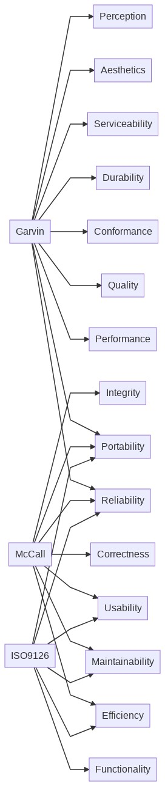
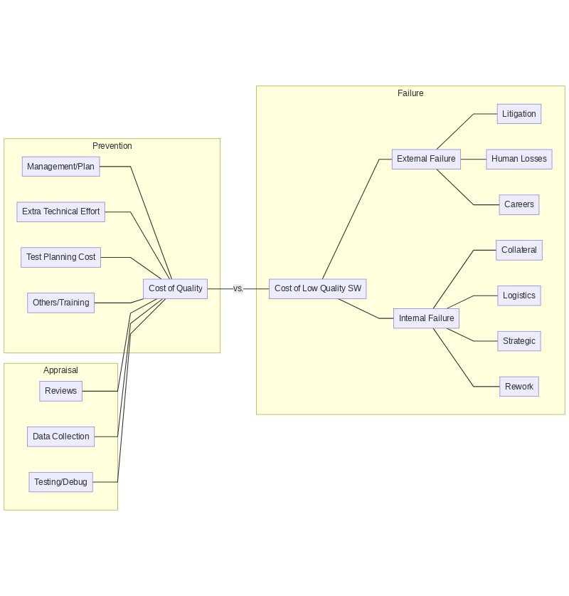
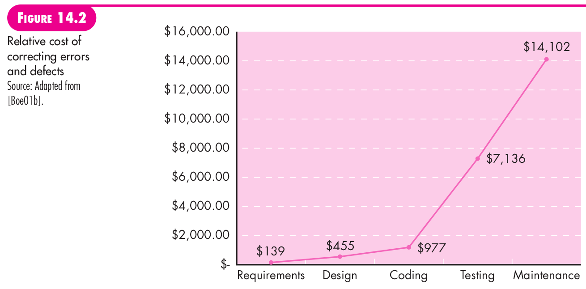
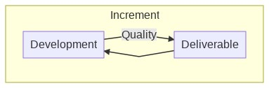
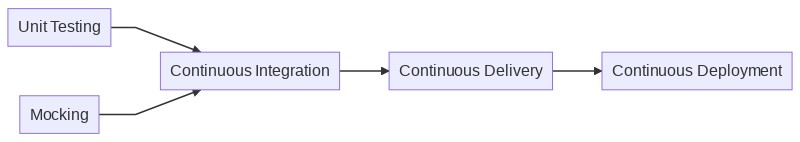

# Week 7 - Theory

Last week we covered topics relating to Modeling/Construction.

This week we will discussing a couple of topics related to both Construction and Deployment.

* Quality Assurance.
* Continuous Integration.
* Design Pattern: State Machines.

Practice Session:
* Data Wrangling.

---
---

# Motivation - Quality Assurance

* Well everybody wants SW that works, that you can feel proud of.

* Yet, this is very vague, like saying we would like to be better at something, and end up falling into in action.

* What I want:
  * Describe what Software Quality Means
  * How do you achieve it
  * What is usually on the way of SW Quality.

* References:
  * Pressman 1.5, 4, 14, 16

## Meaning of Quality
* There are many defnitions of quality
 * Some share the same values: eg those things they aim for.

* It is probably safe to say that by following SW engineering principles, with good criteria, you will achieve it.
  * Pressman 1.5: Principles for SW Engineering Practice.
  * Pressman 4: Principles guiding each practice step:
    * Process: Guide your project management work.
    * Practice: Guide your technical work.
    * Detail for each project phase:
      * Communication
      * Planning
      * Modeling
      * Construction
      * Deployment

## The Quality Dilemma
The quality dilemma is essentially this:

* Good Enough Software
  * This means identifying the main value points and focusing on those:
    * Does the marketing team require a better looking GUI, rather than support for all cases?
  * Also it means understanding what the implications of different costs are:
    * Does the cost of maintenance warrant a complex architecture?

* What is Good Enough Embedded Software?
  * We can't ignore our area, and Embedded Systems interact with persons.
  * Good Enough Embedded Software needs to acertain a minimum threshold:
    * Minimum set of features such that hazards are not created.
    * *Nobody wants good enough aircraft avionics software*

## How do you Achieve Quality

It is the responsability or everybody in the organization:
* It is not just responsability of the QA managers.
* It is not just responsability of the Testers.
* It is not just responsability of the Engineers.

Ultimately Senior Management is responsible, specially of making sure company/team dynamics are such that everybody is covering an aspect of quality.

From different perspectives the actitivites can be synthesized as:
* Software Engineering Methods
* Project Management Techniques
* Quality Control
* Quality Assurance

---
---
# Continuous Integration.

In this section I would like to cover the theory around Continuous Integration and how can it be applied to Embedded Systems.

## Why is this relevant?
* However you call it, Agile, Continuous Delivery etc, all rely on quick small iterations of code.
* The key though is to include activites that increase quality on each iteration.

## What is actually Continuous Integration?
* First let's take a look a the big picture

* Continuous Deploymen: Getting changes into production automatically.
* Continuous Delivery: Getting changes into a test/production environment after building *safely*, *quickly*, in a *sutainable* way.
* Continuous Integration: Is the practice of integrating developers work as often as possible.

## What do you need to do Continuous Integration?

In this lecture I would like to solely focus on Continuous Integration and outline the building blocks you need to practice it.

Summary in one phrase:
* A viable environment to undertake the necessary processes to build/test/release in an *automated* fashion.
* Key enablers:
  * Automation
  * Unit Testing

Some specific elements include:
* A Code Versioning System
* A CI Orchestration System
  * Jenkins
  * GitHub (module)
  * GitLab (module)
  * BitBucket (module)
  * Buildkite
* Time
  * To plan/build the tests
  * To create/maintain infrastructure
* Team buy-in
  * All developers must buy into the flow and contribute to it

## What is Unit Testing

Key enabler for Unit Testing: Mocking.

### Mocking
Is the technique

## Considerations for Embedded Systems

* Check the lecture from week 3. A good SW architecture is critical to enable this.
* Do not understimate the challenges and cost associated to handling low-level HW.
* Do not understimate the un-friendliness of Embedded Dev-Ecosystems.
* Ways of mitigating:
  * Distributed SW architecture.
  * De-Risking HW componentes (eg models, experience).
  * Stay outside of Vendor Specific tools as much as possible (don't be dogmatic, be pragmatic about this).

## Conclusion
* Continuous Integration is the practice of integrating small changes, several times as quickly as possible.
* To make this practice scalable and viable you need automation.
* Proprietary tools without SW friendly interfaces are rife in the embedded world. 
  * Learning and Experience are the only ways of mitigating this.

## Must Check References
* [Throw The Switch](https://www.throwtheswitch.org/)
* [Jumper Virtual Lab Environment](https://docs.jumper.io/)
* [Atlassian: CI vs CD vs CD](https://www.atlassian.com/continuous-delivery/principles/continuous-integration-vs-delivery-vs-deployment)
* [Jenkins for HW Builds](https://fpgalanguages.com/fpga-1//jenkins-for-hw-builds)

## Other References
* [Balena](https://www.balena.io/os/)
* [In the cloud FPGA based simulation](https://fires.im/)
* [Continuous Integration of FPGA Designs](https://indico.cern.ch/event/799025/contributions/3523397/attachments/1901239/3138541/20190903_Continuous_Firmware_Integration_Glein.pdf)
* [Alan Fitch: Continuous Integration for FPGA Design and Verification](https://www.youtube.com/watch?v=P0EHxJ7EhaQ)
* [Jenkins & Embedded: Talks by Oleg Nenashev and Robert Martin](https://www.jenkins.io/solutions/embedded/)

---
---
# Design Pattern: The State Machine

## Description of the Problem

